# Práctica 1

Interconexión de equipos en escritorios virtuales.

## Objetivos

- Cambio de nombres de máquina
- Configurar tarjetas de red
- Configurar servidor DCHP en Ubuntu Server
- Documenta tu práctica con Markdown y GitHub. Comparte tu repositorio con el profesor.

## Punto de partida

- **Máquinas**. Vamos a usar máquinas definidas por el profesor mediante despliegues:
  - Server
  - Cliente Ubuntu
  - Cliente Windows
- **Tarjeas de red**. Todos los equipos tienen 2 o 3 tarjetas de red:
  - Tarjeta **NAT**. Esta tarjeta no permite conectar a las máquinas entre sí pero permite la conexión a internet. Tiene una IP 192.168.x.y/24.
  - Tarjeta **VPN**. Esta tarjeta, si existe, nos permite la conexión directa mediante SSH desde la máquina anfitriona medainte un mecanismo denominado túnel VPN.
  - Tarjeta **sanh3**. Esta tarjeta nos va a permitir intercontectar los equipos entre sí. Todos los equipos del aula están conectados al mismo switch (virtual). Si usamos direcciones IP en la misma red, todos podrán hacer ping entre sí.
- **Nombres de los equipos**. Para renombrar los equipos asignamos un número a cada alumno del grupo de forma correlativa. El profesor usará el número 00. El alumno primero de la lista el 01, y los demás los siguientes números correlativos. Los nombres que usaremos serán:
  - Server --> serverXX
  - Cliente Ubuntu -> ubuntuXX
  - Cliente Windows -> windowsXX

## Configuración del Ubuntu Server.

1. Cambia el nombre de ubuntu server:
  
  

  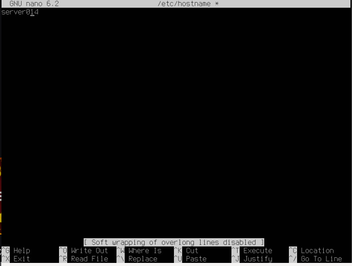

  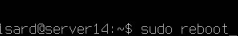

  

  -Otra forma de hacerlo es:

  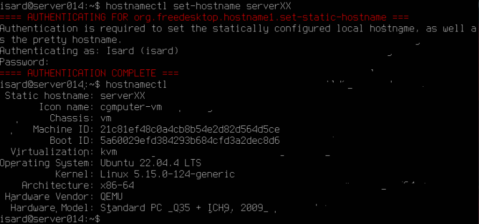

     

2. Configurar tarjetas de red.
   - Disponemos de 3 tarjetas. Las dos primeras deben usar dhcp. La tercera es la que está en la red **sanh3**
   - Configura tu tarjeta de red usando la dirección 192.168.X.1/24.
   - Puerta de enlace. No debes definirla.
   - DNS, tampoco.
   - Toma los ficheros de ejemplo de estos apuntes
   - Aplica los cambios usando `netplan apply`
   - Comprueba que la IP se ha actualizado con el comando `ip a`.

    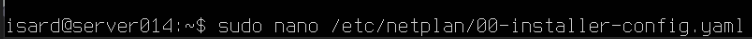

    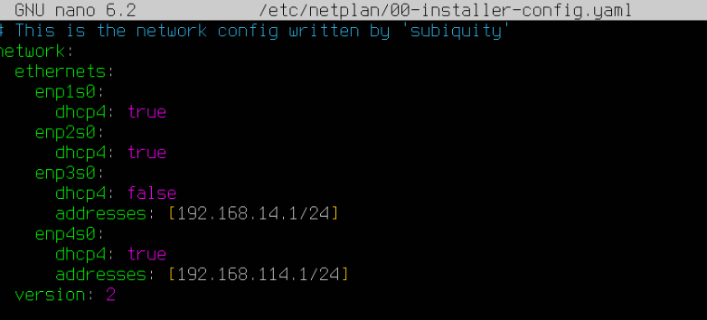

    

    

    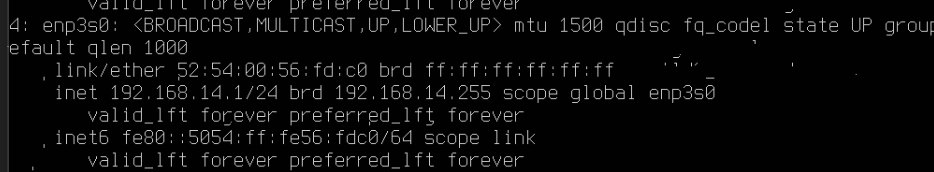
  
  
  
  
  

3. Debe

## Configuración del Cliente Ubuntu

- Busca el diálogo de configuración y cambia el nombre del equipo a `ubuntuXX`.

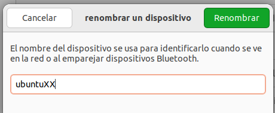

- Busca el diálogo de configuración (windows + red) y cambia la configuración de red usando la dirección 192.168.X.2/24

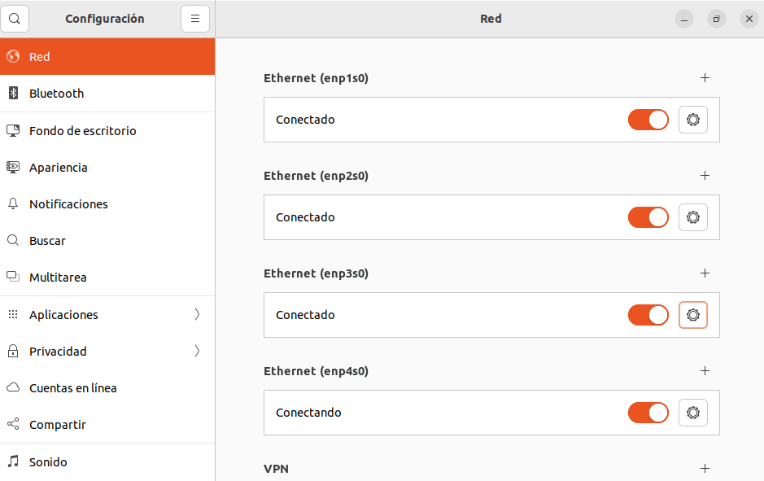

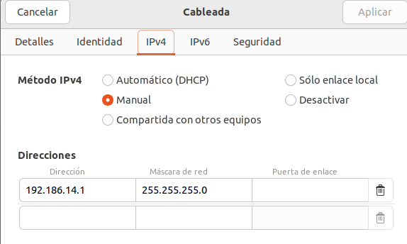

- Comprueba que la IP se ha actualizado con el comando `ip a`.

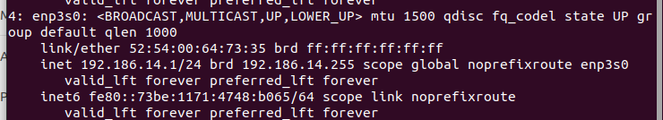

- Prueba la conexión con el servidor con `ping`

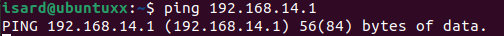

## Configuración del Cliente Windows 10

- Busca el diálogo de configuración y cambia el nombre del equipo a `windowsXX`.

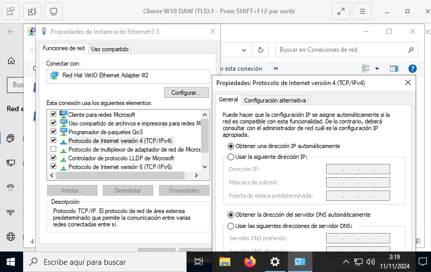

- Busca el diálogo de configuración (windows + conexiones) y cambia la configuración de red usando la dirección 192.168.X.2/24

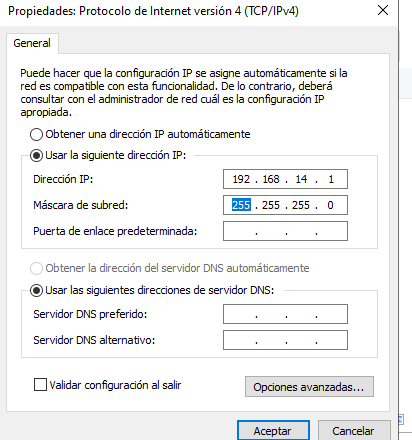

- Comprueba que la IP se ha actualizado con el comando `ipconfig`.

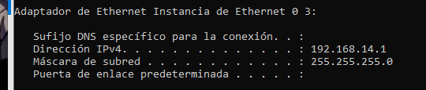

Para cambiar el nombre en Windows: botón derecho sobre icono de equipo.
- Prueba la conexión con el servidor con `ping`

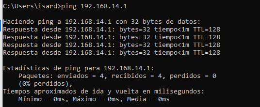

## Configuración DHCP en Ubuntu Server

- Añade una tarjeta de red a tus 3 máquinas asociadas a la red `Personal 1` (Hecho por el profesor). En las máquinas línux se etiquetará como enp4s0.
- Vas a utilizar la dirección de red: 192.168.1XX.0/24, donde XX debes sustituirlo por tu número de alumno.

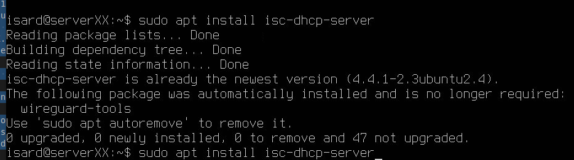

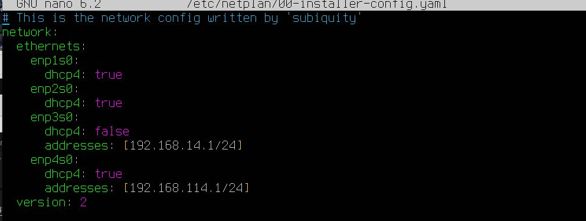

- Configura el servidor DHCP. Debes definir un rango desde la IP 192.168.XX.100 hasta la 192.168.XX.200.

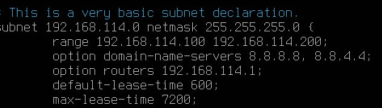

- Comprueba el estado del servicio y que el puerto 67 está en espera (_netstat_).

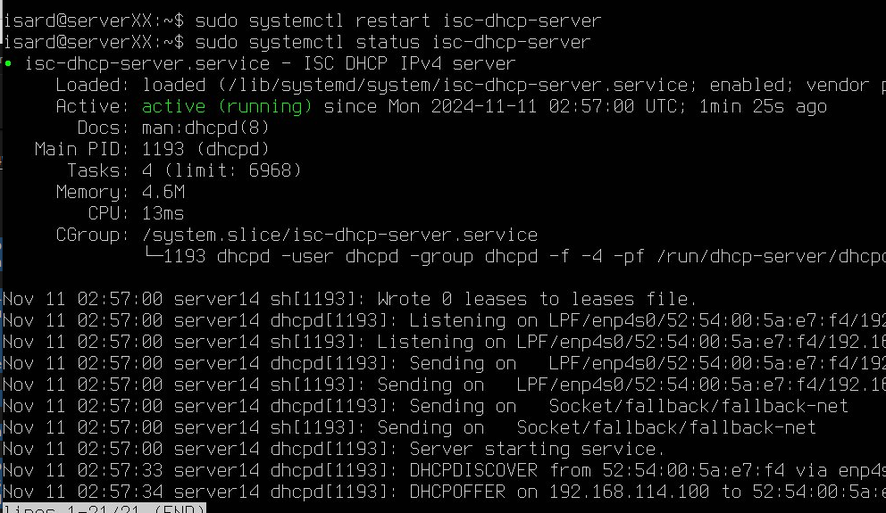

- Prepara tus clientes para que configuren sus tarjetas en la red _Personal 1_ mediante DHCP.
- Comprueba la dirección obtenida y la conexión mediante ping.
- Verifica las _leases_ o préstamos del servidor (_dhcp-lease-list_ y /var/lib/dhcp/dhcpd.leases_)

- Configura una reserva de IP fija en el servidor DHCP. Por ejemplo la dirección 50.
- Reinicia el servicio, y renueva la IP en windows. Verifica que la nueva configuración toma efecto.
- Apaga el servidor. ¿Cambia la configuración de los clientes?

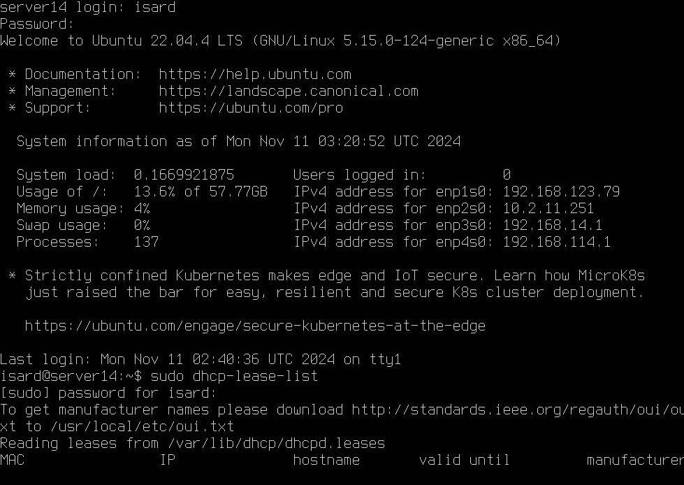

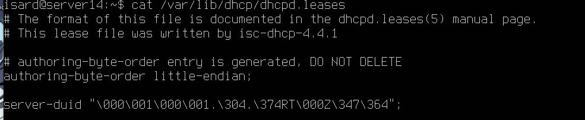

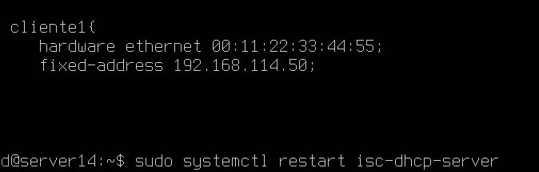